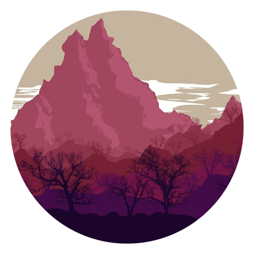

# Personal Portfolio

<div id="top"></div>
<!--
*** Thanks for checking out the Best-README-Template. If you have a suggestion
*** that would make this better, please fork the repo and create a pull request
*** or simply open an issue with the tag "enhancement".
*** Don't forget to give the project a star!
*** Thanks again! Now go create something AMAZING! :D
-->

<!-- PROJECT SHIELDS -->
<!--
*** I'm using markdown "reference style" links for readability.
*** Reference links are enclosed in brackets [ ] instead of parentheses ( ).
*** See the bottom of this document for the declaration of the reference variables
*** for contributors-url, forks-url, etc. This is an optional, concise syntax you may use.
*** https://www.markdownguide.org/basic-syntax/#reference-style-links
-->

[![Contributors][contributors-shield]][contributors-url]
[![Forks][forks-shield]][forks-url]
[![Stargazers][stars-shield]][stars-url]
[![Issues][issues-shield]][issues-url]
[![MIT License][license-shield]][license-url]
[![LinkedIn][linkedin-shield]][linkedin-url]

<!-- PROJECT LOGO -->
<br />
<div align="center">
  <a href="https://github.com/jamestkelly/personal-portfolio">
    
  </a>

<h3 align="center">Personal Portfolio Website</h3>

  <p align="center">
    A simple personal portfolio website.
    <br />
    <a href="https://github.com/jamestkelly/personal-portfolio"><strong>Explore the docs »</strong></a>
    <br />
    ·
    <a href="https://github.com/jamestkelly/personal-portfolio/issues">Report Bug</a>
    ·
    <a href="https://github.com/jamestkelly/personal-portfolio/issues">Request Feature</a>
  </p>
</div>

<!-- TABLE OF CONTENTS -->
<details>
  <summary>Table of Contents</summary>
  <ol>
    <li>
      <a href="#about-the-project">About The Project</a>
      <ul>
        <li><a href="#built-with">Built With</a></li>
      </ul>
    </li>
    <li>
      <a href="#getting-started">Getting Started</a>
      <ul>
        <li><a href="#prerequisites">Prerequisites</a></li>
        <li><a href="#installation">Installation</a></li>
      </ul>
    </li>
    <li><a href="#usage">Usage</a></li>
    <li><a href="#roadmap">Roadmap</a></li>
    <li><a href="#contributing">Contributing</a></li>
    <li><a href="#license">License</a></li>
    <li><a href="#contact">Contact</a></li>
    <li><a href="#acknowledgments">Acknowledgments</a></li>
  </ol>
</details>

<!-- ABOUT THE PROJECT -->

## About The Project

This repository houses the **current** build of my personal portfolio website. This project was built so as to better represent my abilities in web development (full stack development) and further work as a centralised point to access more information about me. A basic design of the desired web platform can be seen [here](https://www.figma.com/file/KKP7CBfZuGCs80q9LqlfzE/Personal-Portfolio-Website-%7C-2022---Present?node-id=0%3A1) as designed on Figma.

In brief, the project has been built through the implementation of ReactJS, Tailwind CSS, THREE.js, and Google Cloud Platform (GCP) Firebase. The current build of the website can be seen [here](http://jim-t-kelly.web.app), as hosted by Firebase.
<p align="right">(<a href="#top">back to top</a>)</p>

### Built With

- [NodeJS](https://nodejs.org/en/)
- `@emailjs/browser`: ^3.4.0
- `firebase`: ^9.6.7
- `pathseg`: ^1.2.1
- `react`: ^17.0.2
- `react-icon-cloud`: ^4.0.0
- `react-icons`: ^4.3.1
- `react-modal`: ^3.14.4
- `react-scroll`: ^1.8.4
- `react-tsparticles`: ^1.41.1
- `simpleicons`: ^6.10.0

<p align="right">(<a href="#top">back to top</a>)</p>

<!-- GETTING STARTED -->

## Getting Started

### Prerequisites

Please be aware the setup to build and run this website differs respective to each operating system (OS). Furthermore, I'm also assuming that you already have [NodeJS](https://nodejs.org/en/) and [React](https://reactjs.org) already installed or available within your environment. After confirming this, you'll need to perform the following steps to prepare your local environment.

- npm

  ```sh
  cd /path/to/your/directory # Navigate to where you want to clone the repository. 
  git clone https://github.com/jamestkelly/personal-portfolio.git # Clone the repository.
  cd /path/to/personal-portfolio # Navigate into the repository.
  npm install # Install the necessary packages.
  ```

### Installation

1. Clone the repository

   ```sh
   git clone https://github.com/jamestkelly/personal-portfolio.git
   ```

2. Install NPM packages

   ```sh
   npm install
   ```

3. Run the website locally to verify it works correctly prior to deployment.

   ```sh
   npm run # Run the bot on your local host
   ```

4. Build and then deploy the web application to any hosting service you prefer.
   
   ```sh
   npm run build
   ```

<p align="right">(<a href="#top">back to top</a>)</p>

<!-- USAGE EXAMPLES -->

## Usage

This project can be used as an example or starting point for others looking to design, build, and host their own personal portfolio websites. Additionalyl, it predominantly works to represent my most current abilities as a developer within web frameworks, namely with THREE.js, hosting, and pipelining.

<p align="right">(<a href="#top">back to top</a>)</p>

<!-- ROADMAP -->

## Roadmap

- [x] Design website and UI/UX flow.
- [x] Build individual components:
  - [x] THREE.js sphere to show languages and tools I can use.
  - [x] THREE.js interactable splash art on the landing.
  - [x] Email service.
- [x] Host the website.
- [x] Develop the pipeline for CI/CD. 

See the [open issues](https://github.com/jamestkelly/personal-portfolio/issues) for a full list of proposed features (and known issues).

<p align="right">(<a href="#top">back to top</a>)</p>

<!-- CONTRIBUTING -->

## Contributing

Contributions are what make the open source community such an amazing place to learn, inspire, and create. Any contributions you make are **greatly appreciated**.

If you have a suggestion that would make this better, please fork the repo and create a pull request. You can also simply open an issue with the tag "enhancement".
Don't forget to give the project a star! Thanks again!

1. Fork the Project
2. Create your Feature Branch (`git checkout -b feature/AmazingFeature`)
3. Commit your Changes (`git commit -m 'Add some AmazingFeature'`)
4. Push to the Branch (`git push origin feature/AmazingFeature`)
5. Open a Pull Request

<p align="right">(<a href="#top">back to top</a>)</p>

<!-- LICENSE -->

## License

Distributed under the MIT License. See `LICENSE` for more information.

<p align="right">(<a href="#top">back to top</a>)</p>

<!-- CONTACT -->

## Contact

Jim Kelly - jimkelly.t@outlook.com

Project Link: [https://github.com/jamestkelly/personal-portfolio](https://github.com/jamestkelly/personal-portfolio)

<p align="right">(<a href="#top">back to top</a>)</p>

<!-- ACKNOWLEDGMENTS -->

## Acknowledgments

The development of this website was made possible to the standard that it is through some of the following resources.

- [Build & Deploy a Personal Portfolio with Tailwind CSS](https://youtu.be/Vp6GC3jKG20)
- [Ultimate Tailwind CSS Tutorial](https://youtu.be/pfaSUYaSgRo)

### Service Providers

- [Firebase](https://firebase.google.com/)

<p align="right">(<a href="#top">back to top</a>)</p>

<!-- MARKDOWN LINKS & IMAGES -->
<!-- https://www.markdownguide.org/basic-syntax/#reference-style-links -->

[contributors-shield]: https://img.shields.io/github/contributors/jamestkelly/personal-portfolio.svg?style=for-the-badge
[contributors-url]: https://github.com/jamestkelly/personal-portfolio/graphs/contributors
[forks-shield]: https://img.shields.io/github/forks/jamestkelly/personal-portfolio.svg?style=for-the-badge
[forks-url]: https://github.com/jamestkelly/personal-portfolio/network/members
[stars-shield]: https://img.shields.io/github/stars/jamestkelly/personal-portfolio.svg?style=for-the-badge
[stars-url]: https://github.com/jamestkelly/personal-portfolio/stargazers
[issues-shield]: https://img.shields.io/github/issues/jamestkelly/personal-portfolio.svg?style=for-the-badge
[issues-url]: https://github.com/jamestkelly/personal-portfolio/issues
[license-shield]: https://img.shields.io/github/license/jamestkelly/personal-portfolio.svg?style=for-the-badge
[license-url]: https://github.com/jamestkelly/personal-portfolio/blob/master/LICENSE.txt
[linkedin-shield]: https://img.shields.io/badge/-LinkedIn-black.svg?style=for-the-badge&logo=linkedin&colorB=555
[linkedin-url]: https://linkedin.com/in/jimkellyt